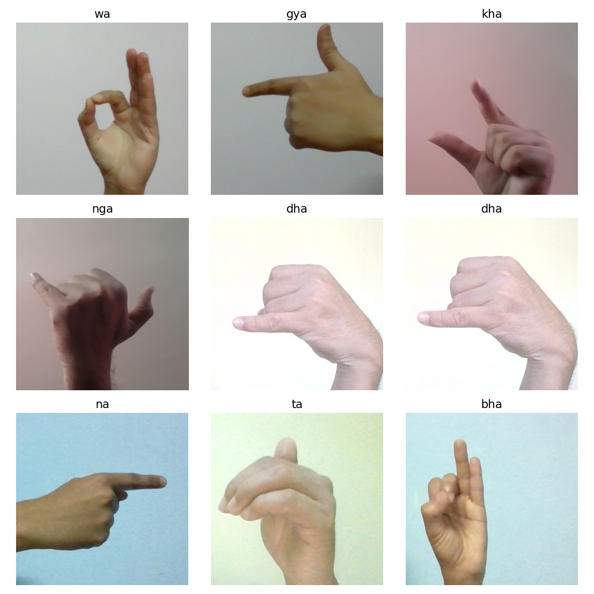
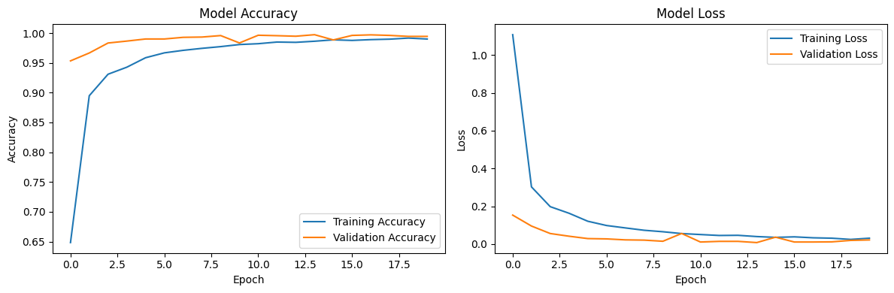

# Nepali Sign Language Character Recognition

Welcome to the **Nepali Sign Language Character Recognition** project! This project aims to develop a Convolutional Neural Network (CNN) to recognize characters from the Nepali Sign Language (NSL) dataset, enabling better accessibility and communication for the deaf and hard-of-hearing community in Nepal.

## Table of Contents

- [Project Overview](#project-overview)
- [Dataset](#dataset)
- [Model Architecture](#model-architecture)
- [Installation](#installation)
- [Usage](#usage)
- [Live Testing](#live-testing)
- [Results](#results)
- [Contributing](#contributing)
- [License](#license)
- [Acknowledgements](#acknowledgements)

## Project Overview

This project implements a deep learning model using TensorFlow and Keras to classify images of hand gestures representing characters in Nepali Sign Language. The model is trained on a dataset containing images with both plain and random backgrounds, achieving robust performance for real-world applications. Additionally, a live testing feature allows real-time recognition using a webcam.

The project includes:

- **Data Preprocessing**: Loading and normalizing images from the NSL dataset.
- **CNN Model**: A custom-built convolutional neural network for character classification.
- **Training and Evaluation**: Training the model with a train-test split and evaluating its performance.
- **Visualization**: Plotting training and validation accuracy/loss for analysis.
- **Live Testing**: Real-time gesture recognition using MediaPipe and a webcam.

## Dataset

The dataset used is the [Nepali Sign Language Character Dataset](https://www.kaggle.com/datasets/biratpoudelrocks/nepali-sign-language-character-dataset) available on Kaggle. It contains:

- **36 Classes**: Representing different characters in Nepali Sign Language.
- **Two Background Types**:
  - **Plain Background**: 1,000 images per class (36,000 total).
  - **Random Background**: 500 images per class (18,000 total).
- **Image Size**: Resized to 64x64 pixels for model input.
- **Total Images**: 54,000 images (36,000 plain + 18,000 random).

The dataset is organized into folders named `NSL/Plain Background` and `NSL/Random Background`, with subfolders for each class (0–35).



## Model Architecture

The CNN model is designed to effectively capture spatial features from hand gesture images. The architecture is as follows:

| Layer Type           | Output Shape        | Parameters |
| -------------------- | ------------------- | ---------- |
| Conv2D (32 filters)  | (None, 62, 62, 32)  | 896        |
| MaxPooling2D         | (None, 31, 31, 32)  | 0          |
| Conv2D (64 filters)  | (None, 29, 29, 64)  | 18,496     |
| MaxPooling2D         | (None, 14, 14, 64)  | 0          |
| Conv2D (128 filters) | (None, 12, 12, 128) | 73,856     |
| MaxPooling2D         | (None, 6, 6, 128)   | 0          |
| Flatten              | (None, 4608)        | 0          |
| Dense (128 units)    | (None, 128)         | 589,952    |
| Dropout (0.5)        | (None, 128)         | 0          |
| Dense (36 units)     | (None, 36)          | 4,644      |

**Total Parameters**: 687,844  
**Optimizer**: Adam  
**Loss Function**: Categorical Crossentropy  
**Metrics**: Accuracy

The model uses three convolutional layers with ReLU activation, followed by max-pooling layers to reduce spatial dimensions. A dropout layer (0.5) is included to prevent overfitting, and the final dense layer outputs probabilities for the 36 classes using softmax activation.

## Installation

To run this project locally, follow these steps:

1. **Clone the Repository**:

   ```bash
   git clone https://github.com/your-username/nepali-sign-language-recognition.git
   cd nepali-sign-language-recognition
   ```

2. **Install Dependencies**:
   Ensure you have Python 3.11 or higher installed. Install the required packages using:

   ```bash
   pip install -r requirements.txt
   ```

   Create a `requirements.txt` file with:

   ```
   tensorflow
   numpy
   matplotlib
   scikit-learn
   kagglehub
   opencv-python
   mediapipe
   ```

3. **Download the Dataset**:
   Use KaggleHub to download the dataset:

   ```python
   import kagglehub
   path = kagglehub.dataset_download("biratpoudelrocks/nepali-sign-language-character-dataset")
   ```

4. **Set Up Environment**:
   Ensure you have a GPU-enabled environment (e.g., Google Colab with T4 GPU) for faster training. For live testing, a webcam is required.

## Usage

1. **Prepare the Dataset**:
   Ensure the dataset is downloaded and accessible at the path provided by `kagglehub.dataset_download`.

2. **Run the Jupyter Notebook**:
   Open the `signLanguage.ipynb` notebook in Jupyter or Google Colab:

   ```bash
   jupyter notebook signLanguage.ipynb
   ```

3. **Train the Model**:
   Execute the notebook cells to preprocess the data, build the model, and train it for 20 epochs. The model will be saved as `nepali_sign_language_cnn.h5`.

4. **Evaluate and Visualize**:
   The notebook generates a plot (`training_history.png`) showing training and validation accuracy/loss.

## Live Testing

The `livetest.py` script enables real-time recognition of Nepali Sign Language characters using a webcam. It uses MediaPipe for hand detection and the trained model for classification. To use it:

1. **Run the Script**:

   ```bash
   python livetest.py
   ```

2. **Features**:

   - Detects hand landmarks and draws a bounding box around the hand.
   - Displays the predicted character and confidence percentage on the screen.
   - Smooths predictions using a queue to reduce noise.
   - Press 'q' to quit the application.

3. **Requirements**:
   - A working webcam.
   - The trained model file `nepali_sign_language_cnn.h5` in the project directory.

## Results

The model was trained for 20 epochs with a batch size of 32. The test accuracy achieved is approximately 0.95, as indicated by the evaluation metrics. The training history plot below shows the model's performance over time, indicating convergence and effective generalization with minimal overfitting due to the dropout layer.



Key observations:

- Training and validation accuracy converge around 0.95.
- Training and validation loss decrease steadily, stabilizing below 0.2.
- The model performs well across both plain and random background images.

For detailed results, refer to the `training_history.png` file generated after training.

## Contributing

Contributions are welcome! To contribute:

1. Fork the repository.
2. Create a new branch (`git checkout -b feature-branch`).
3. Make your changes and commit (`git commit -m "Add feature"`).
4. Push to the branch (`git push origin feature-branch`).
5. Create a Pull Request.

Please ensure your code follows PEP 8 guidelines and includes appropriate documentation.

## License

This project is licensed under the MIT License. See the [LICENSE](LICENSE) file for details.

## Acknowledgements

- **Dataset Provider**: [Birat Poudel](https://www.kaggle.com/biratpoudelrocks) for the Nepali Sign Language Character Dataset.
- **Libraries**: TensorFlow, Keras, NumPy, Matplotlib, Scikit-learn, KaggleHub, OpenCV, and MediaPipe.
- **Community**: Thanks to the open-source community for providing tools and resources to make this project possible.

---

_Built with ❤️ for accessibility and inclusion._
