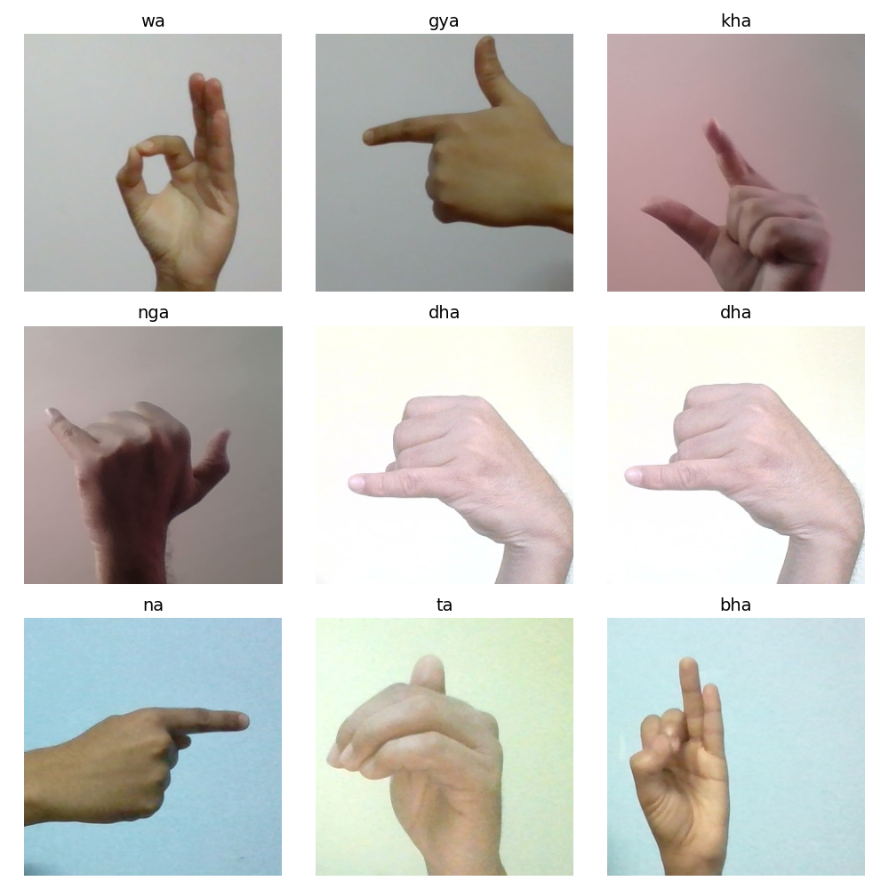
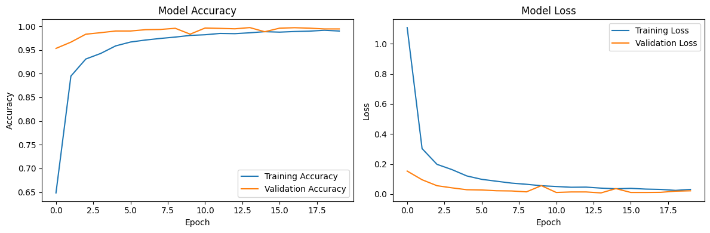

# Nepali Sign Language Character Recognition

Welcome to the **Nepali Sign Language Character Recognition** project! This project develops a machine learning model to recognize characters from the Nepali Sign Language (NSL) dataset, enhancing accessibility and communication for the deaf and hard-of-hearing community in Nepal.

## Table of Contents

- [Project Overview](#project-overview)
- [Dataset](#dataset)
- [Model Architectures](#model-architectures)
  - [Original CNN Model](#original-cnn-model)
  - [New Landmark-Based Model](#new-landmark-based-model)
  - [Comparison: Why the New Model Excels](#comparison-why-the-new-model-excels)
- [Installation](#installation)
- [Usage](#usage)
- [Live Testing](#live-testing)
- [Results](#results)
- [Contributing](#contributing)
- [License](#license)
- [Acknowledgements](#acknowledgements)

## Project Overview

This project implements machine learning models to classify hand gestures representing Nepali Sign Language characters. Two approaches are explored:

1. **Original CNN Model**: A convolutional neural network (CNN) that processes raw images from the NSL dataset.
2. **New Landmark-Based Model**: A dense neural network that uses hand landmarks extracted via MediaPipe for classification, optimized for real-time webcam recognition.

Both models are trained on the same dataset, but the new landmark-based approach leverages hand landmark features for improved robustness and efficiency in real-time applications. The project includes data preprocessing, model training, evaluation, visualization, and live testing with a webcam.

## Dataset

The dataset used is the [Nepali Sign Language Character Dataset](https://www.kaggle.com/datasets/biratpoudelrocks/nepali-sign-language-character-dataset) from Kaggle, containing:

- **36 Classes**: Representing Nepali Sign Language characters (e.g., क (ka), ख (kha), ग (ga), घ (gha), ङ (nga), ...,  ज्ञ (gya)).
- **Two Background Types**:
  - **Plain Background**: 1,000 images per class (36,000 total).
  - **Random Background**: 500 images per class (18,000 total).
- **Image Size**: 64x64 pixels (for CNN model input); raw images for landmark extraction.
- **Total Images**: 54,000 images (36,000 plain + 18,000 random).

The dataset is organized into `NSL/Plain Background` and `NSL/Random Background` folders, with subfolders for each class (0–35).



## Model Architectures

### Original CNN Model

The original model is a CNN designed to capture spatial features from hand gesture images. Its architecture is:

| Layer Type           | Output Shape        | Parameters |
|--------------------|---------------------|------------|
| Conv2D (32 filters)  | (62, 62, 32)       | 896        |
| MaxPooling2D         | (31, 31, 32)       | 0          |
| Conv2D (64 filters)  | (29, 29, 64)       | 18,496     |
| MaxPooling2D         | (14, 14, 64)       | 0          |
| Conv2D (128 filters) | (12, 12, 128)      | 73,856     |
| MaxPooling2D         | (6, 6, 128)        | 0          |
| Flatten              | (4608)             | 0          |
| Dense (128 units)    | (128)              | 589,952    |
| Dropout (0.5)        | (128)              | 0          |
| Dense (36 units)     | (36)               | 4,644      |

- **Total Parameters**: 687,844
- **Optimizer**: Adam
- **Loss Function**: Categorical Crossentropy
- **Metrics**: Accuracy

The CNN processes resized 64x64 images and achieves high accuracy but is computationally intensive for real-time applications.

### New Landmark-Based Model

The new model uses MediaPipe to extract 63-dimensional hand landmark features (x, y, z coordinates for 21 landmarks) from images, followed by a dense neural network for classification. The architecture is simpler:

| Layer Type         | Output Shape | Parameters |
|--------------------|--------------|------------|
| Dense (128 units)  | (128)        | 8,192      |
| Dropout (0.2)      | (128)        | 0          |
| Dense (64 units)   | (64)         | 8,256      |
| Dropout (0.2)      | (64)         | 0          |
| Dense (36 units)   | (36)         | 2,340      |

- **Total Parameters**: ~18,788
- **Input**: 63-dimensional landmark vectors (standardized using `StandardScaler`).
- **Optimizer**: Adam
- **Loss Function**: Sparse Categorical Crossentropy
- **Metrics**: Accuracy

Landmarks are extracted using MediaPipe's Hands module, scaled with `StandardScaler`, and fed into the dense network. The model is saved as `nsl_model.h5`, and the scaler is saved as `scaler.pkl`.

### Comparison: Why the New Model Excels

The landmark-based model offers several advantages over the CNN model, particularly for real-time applications:

- **Efficiency**: 
  - The CNN processes entire 64x64 images, requiring ~687,844 parameters and significant computational resources.
  - The landmark-based model uses 63-dimensional feature vectors, reducing the parameter count to ~18,788, making it faster and more suitable for real-time webcam processing.

- **Robustness to Background Noise**:
  - The CNN relies on pixel data, which can be sensitive to background variations despite training on mixed backgrounds.
  - The landmark-based model focuses on hand landmarks, ignoring irrelevant background details, improving performance in diverse environments.

- **Real-Time Performance**:
  - The CNN requires image resizing and intensive convolution operations, which can introduce latency in live testing.
  - MediaPipe's hand detection is optimized for real-time applications, and the dense network processes lightweight landmark vectors, enabling smoother webcam-based recognition.

- **Generalization**:
  - The landmark-based approach normalizes hand positions via `StandardScaler`, making it less sensitive to variations in hand size or orientation.
  - The CNN may struggle with slight pose variations not seen in the training set.

**Trade-Offs**:
- The CNN may capture finer image-based details (e.g., skin texture), potentially achieving slightly higher accuracy on the training dataset (~0.95 test accuracy).
- The landmark-based model sacrifices some image-based detail for speed and robustness, but its accuracy remains comparable due to MediaPipe's reliable landmark extraction.

For live testing, the landmark-based model is preferred due to its efficiency and robustness, as demonstrated in `webcam_nsl_prediction.py`.

## Installation

To set up the project locally:

1. **Clone the Repository**:
   ```bash
   git clone https://github.com/your-username/nepali-sign-language-recognition.git
   cd nepali-sign-language-recognition
   ```

2. **Install Dependencies**:
   Ensure Python 3.11+ is installed. Create a `requirements.txt` with:
   ```
   tensorflow
   numpy
   matplotlib
   scikit-learn
   kagglehub
   opencv-python
   mediapipe
   tqdm
   ```
   Install using:
   ```bash
   pip install -r requirements.txt
   ```

3. **Download the Dataset**:
   Use KaggleHub to download the dataset:
   ```python
   import kagglehub
   path = kagglehub.dataset_download("biratpoudelrocks/nepali-sign-language-character-dataset")
   ```

4. **Set Up Environment**:
   A GPU-enabled environment (e.g., Google Colab with T4 GPU) is recommended for faster training. A webcam is required for live testing.

## Usage

1. **Prepare the Dataset**:
   Ensure the dataset is accessible at the path provided by `kagglehub.dataset_download`.

2. **Run the Jupyter Notebook**:
   Open `nepali_sign_characters.ipynb` in Jupyter or Google Colab:
   ```bash
   jupyter notebook nepali_sign_characters.ipynb
   ```

3. **Train the Model**:
   - Execute the notebook cells to preprocess data (landmark extraction for the new model or image loading for the CNN).
   - Train the landmark-based model to generate `nsl_model.h5` and `scaler.pkl`, or the CNN model to generate `nepali_sign_language_cnn.h5`.
   - Training takes ~20 epochs for the CNN or ~10 epochs for the landmark-based model.

4. **Evaluate and Visualize**:
   The notebook generates a plot (`training_history.png`) showing training and validation accuracy/loss for either model.



## Live Testing

The `webcam_nsl_prediction.py` script enables real-time recognition using the landmark-based model:

1. **Run the Script**:
   Ensure `nsl_model.h5` and `scaler.pkl` are in the same directory, then run:
   ```bash
   python webcam_nsl_prediction.py
   ```

2. **Features**:
   - Detects hand landmarks using MediaPipe and draws them on the webcam feed.
   - Displays the predicted Nepali character and confidence score.
   - Press 'q' to quit.

3. **Requirements**:
   - A working webcam.
   - The trained model (`nsl_model.h5`) and scaler (`scaler.pkl`).

## Results

- **CNN Model**:
  - Trained for 20 epochs, batch size 32.
  - Test accuracy: ~0.95.
  - Training/validation loss converges below 0.2, with minimal overfitting due to dropout.

- **Landmark-Based Model**:
  - Trained for ~10 epochs.
  - Test accuracy: Comparable to CNN (slightly lower due to reduced complexity but still robust).
  - Faster inference, suitable for real-time applications.

The training history plot (`training_history.png`) shows convergence for both models. The landmark-based model excels in live testing due to its efficiency and robustness to background variations.


## Contributing

Contributions are welcome! To contribute:
1. Fork the repository.
2. Create a branch (`git checkout -b feature-branch`).
3. Make changes and commit (`git commit -m "Add feature"`).
4. Push to the branch (`git push origin feature-branch`).
5. Create a Pull Request.

Please follow PEP 8 guidelines and include documentation.

## License

This project is licensed under the MIT License. See the [LICENSE](LICENSE) file for details.

## Acknowledgements

- **Dataset Provider**: [Birat Poudel](https://www.kaggle.com/biratpoudelrocks) for the Nepali Sign Language Character Dataset.
- **Libraries**: TensorFlow, Keras, NumPy, Matplotlib, Scikit-learn, KaggleHub, OpenCV, MediaPipe, tqdm.
- **Community**: Thanks to the open-source community for enabling this project.
